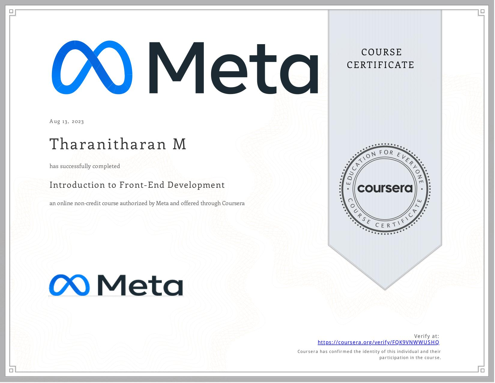

# Introduction to Front-End Development

Welcome to the first course of the **Meta Front-End Developer Professional Certificate**: "Introduction to Front-End Development." 🌟

This course will introduce you to the fundamentals of web development, from creating your first web page to understanding HTML, CSS, and UI frameworks. Below, you can find links to each week's materials, and at the end, you'll find my certificate of completion!

## Table of Contents

- [Week 1 - Get Started with Web Development](./Week%201%20-%20Get%20Started%20with%20Web%20Development)
- [Week 2 - Introduction to HTML and CSS](./Week%202%20-%20Introduction%20to%20HTML%20and%20CSS)
- [Week 3 - UI Frameworks](./Week%203%20-%20UI%20Frameworks)
- [Week 4 - End of Course Assessment](./Week%204%20-%20End%20of%20the%20course%20Assesment)

## Embrace Learning! 🚀

Feel free to explore each week's content, including assignments, demos, and cheat sheets. This course is the foundation of your front-end development journey, and I'm excited to share my progress with you!

## Proof of Completion

I have successfully completing this course! 🎉

---

Back to [Main README](../README.md)
