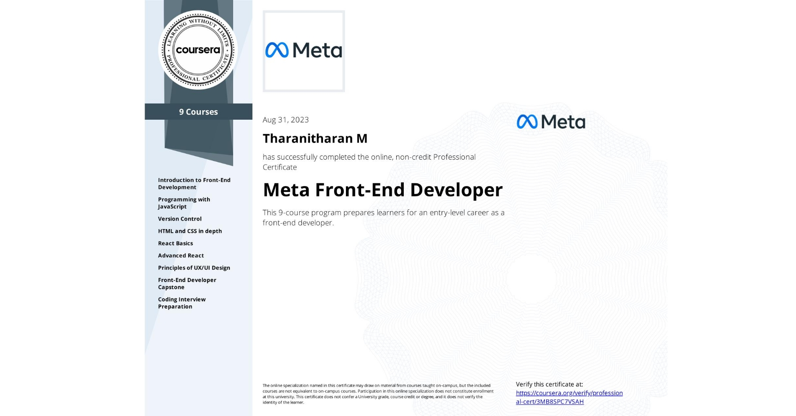

# Meta Front-End Developer Professional Certificate

👋 Welcome to my repository for the **Meta Front-End Developer Professional Certificate** program on Coursera! This repository is a treasure trove of my assignments, demos, and cheat sheets from all nine courses in this certification.

## Table of Contents

<b>Course 1: Introduction to Front-End Development</b>

- 
- 
- 
- 

<b>Course 2: Programming with JavaScript</b>

- 
- 
- 
- 
- 

<b>Course 3: Version Control</b>

- 
- 
- 
- 

<b>Course 4: HTML and CSS in Depth</b>

- 
- 
- 

<b>Course 5: React Basics</b>

- 
- 
- 
- 

<b>Course 6: Advanced React</b>

- 
- 
- 
- 

<b>Course 7: Principles of UI/UX Design</b>

- 
- 
- 
- 

<b>Course 8: Front-End Developer Capstone</b>

- 
- 
- 
- 
- 

<b>Course 9: Coding Interview Preparation</b>

- 
- 
- 
- 
- 

## Proof of Completion

📚 Feel free to explore, learn, and connect with me if you have any questions or want to discuss web development and technology. Let's grow together! 🚀
